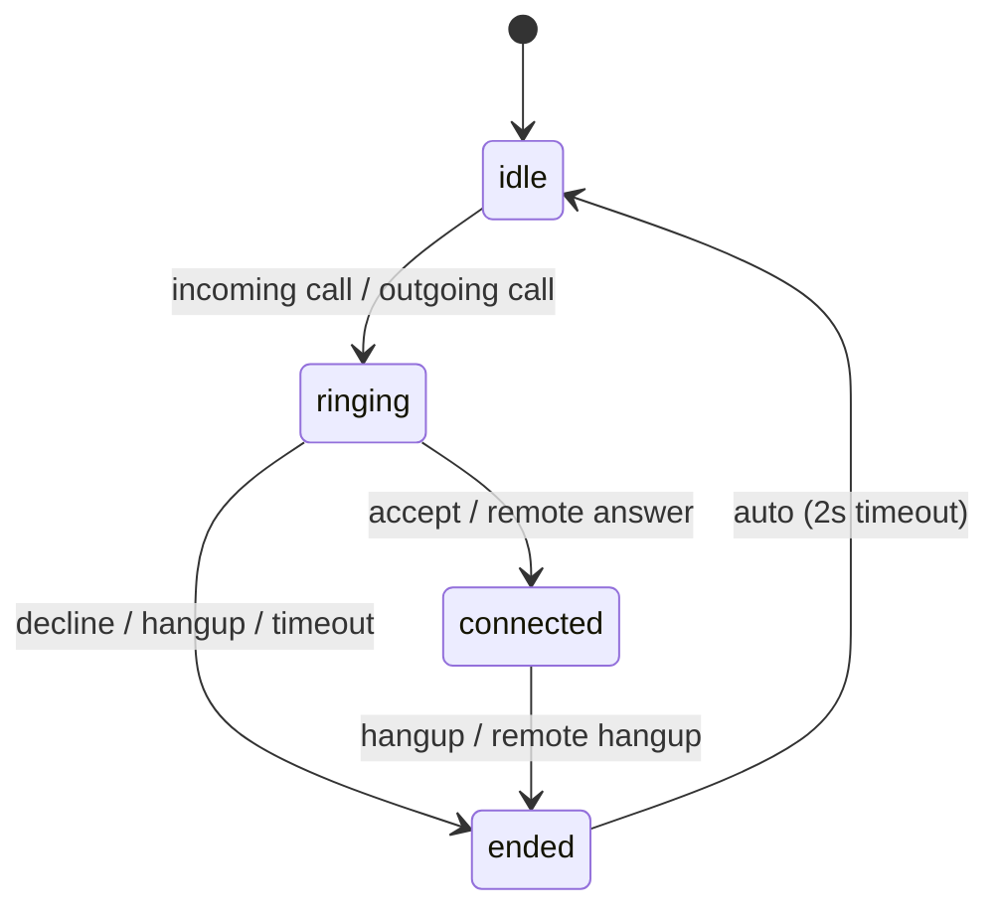

# leadtodeed-widget

Pure phone/state library for Asterisk/FreePBX via JsSIP WebRTC.

No built-in UI — your app provides a `renderer(state)` callback that receives every state change.

## Install

```bash
npm install leadtodeed-widget
```

## Quick Start

```js
import Leadtodeed from 'leadtodeed-widget'

const phone = Leadtodeed({
  subdomain: 'your-tenant',
  tokenUrl: '/api/leadtodeed/token',
  renderer: (state) => {
    console.log(state.phase, state.number)
  },
  onIncomingCall: async (callerNumber) => {
    // Optional: return enrichment data (added as transcript event)
    const resp = await fetch(`/api/lookup?phone=${callerNumber}`)
    if (!resp.ok) return null
    const data = await resp.json()
    return { number: callerNumber, text: data.name }
  },
})
```

The `renderer` receives a state object on every change:

```js
{
  phase,        // "idle" | "ringing" | "connected" | "ended"
  number,       // caller/callee phone number
  direction,    // "incoming" | "outgoing"
  connectedAt,  // timestamp (ms) when call connected
  events,       // append-only log: [{ id, type, ts, data }]
  accept(),     // answer incoming call
  decline(),    // reject incoming call
  hangup(),     // end active call
}
```

## Methods

`Leadtodeed()` returns a `LeadtodeedPhone` instance:

| Method | Description |
|--------|-------------|
| `connect()` | Fetch token, retrieve SIP config, and register. Returns a `Promise`. |
| `call(number)` | Start an outgoing call. Non-digit characters (except `+`) are stripped. |
| `hangup()` | End the current call. |
| `answer()` | Answer an incoming call. |
| `reject()` | Reject an incoming call. |
| `addEvent(type, data)` | Push a custom event to the state log. |
| `disconnect()` | Unregister from SIP and clean up. |

## Testing from Console

For development without a real SIP connection:

```js
// Simulate incoming call (ringing → connected → ended)
window.leadtodeedPhone.simulateIncomingCall({ callerName: 'John Smith', callerNumber: '+441234567890' })
window.leadtodeedPhone.simulateAnswer()
window.leadtodeedPhone.simulateEnd()

// Simulate outgoing call
window.leadtodeedPhone.simulateOutgoingCall('+441234567890')
window.leadtodeedPhone.simulateEnd()
```

## Call State Machine


