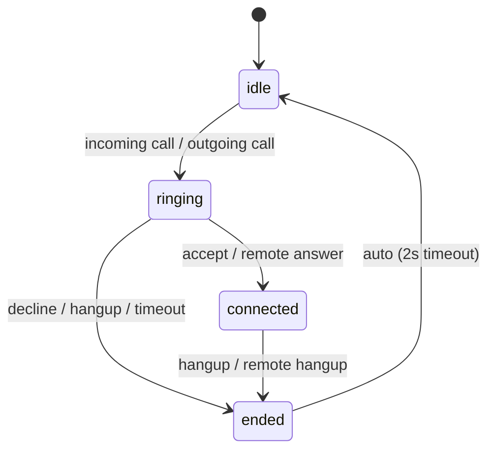

# leadtodeed-widget

Pure phone/state library for Asterisk/FreePBX via JsSIP WebRTC.

No built-in UI — your app provides a `renderer(state)` callback that receives every state change.

## Install

```bash
npm install leadtodeed-widget
```

## Quick Start

```js
import Leadtodeed from 'leadtodeed-widget'

const phone = Leadtodeed({
  subdomain: 'your-tenant',
  tokenUrl: '/api/leadtodeed/token',
  renderer: (state) => {
    console.log(state.phase, state.number)
  },
  onIncomingCall: async (callerNumber) => {
    // Optional: return enrichment data (added as transcript event)
    const resp = await fetch(`/api/lookup?phone=${callerNumber}`)
    if (!resp.ok) return null
    const data = await resp.json()
    return { number: callerNumber, text: data.name }
  },
})
```

The `renderer` receives a state object on every change:

```js
{
  phase,         // "idle" | "ringing" | "connected" | "ended"
  number,        // caller/callee phone number
  direction,     // "incoming" | "outgoing"
  connectedAt,   // timestamp (ms) when call connected
  events,        // append-only log: [{ id, type, ts, data }]
  outboundClid,  // outgoing: the line this call is going out on
  outboundLabel, // its human name, when the server has one ("Acme Legal")
  endReason,     // why the call ended, when the server gave a reason
  accept(),      // answer incoming call
  decline(),     // reject incoming call
  hangup(),      // end active call
}
```

## Extension federation

When the leadtodeed Chrome extension (l2d-ext) is installed, its offscreen
document is a strictly more stable SIP holder than any tab — it survives page
refreshes, tab closes, and (with the `background` permission) closing the last
window. On init the widget probes for the extension's bridge content script
(`window.postMessage` handshake). A healthy extension running as the **same
identity** (JWT `sub`) wins: the page widget skips SIP registration entirely
and renders the extension's relayed state through the normal `renderer` —
states arrive with `viaExtension: true`, and `call()`/`accept()`/etc. forward
over the bridge. If the extension disappears (bye, or 90s of silence), the
usual same-origin tab election resumes automatically.

On a `sub` mismatch the widget keeps its own SIP (both register; the PBX
allows multiple contacts) and passes `extensionIdentity: {sub, displayName}`
in every render so the UI can hint "extension is signed in as …".

Related options:

```js
Leadtodeed({
  subdomain: 'acme',
  tokenProvider: async () => myJwt,  // instead of tokenUrl — for contexts with
                                     // their own auth (the extension offscreen doc)
  leadership: false,                 // no tab election — the extension offscreen
                                     // doc is structurally the only SIP owner
  extensionFederation: false,        // opt out of the probe entirely
  onRefreshRequested: (data) => {},  // overrides the location.reload() on a
                                     // server-initiated refresh
  capabilities: {                    // injected controller capabilities; stored
    getEnrichment: async (num) => {},//   on phone.capabilities, getEnrichment
    getAddTargets: async () => [],   //   aliases onIncomingCall
  },
})
```

## Methods

`Leadtodeed()` returns a `LeadtodeedPhone` instance:

| Method | Description |
|--------|-------------|
| `connect()` | Fetch token, retrieve SIP config, and register. Returns a `Promise`. |
| `call(number, { callerId })` | Start an outgoing call. Non-digit characters (except `+`) are stripped from `number`. `callerId` (E.164) asks the server to assert that number as caller ID on this call — see [Outbound caller ID](#outbound-caller-id). |
| `hangup()` | End the current call. |
| `answer()` | Answer an incoming call. |
| `reject()` | Reject an incoming call. |
| `addEvent(type, data)` | Push a custom event to the state log. |
| `disconnect()` | Unregister from SIP and clean up. |

## Testing from Console

For development without a real SIP connection:

```js
// Simulate incoming call (ringing → connected → ended)
window.leadtodeedPhone.simulateIncomingCall({ callerName: 'John Smith', callerNumber: '+441234567890' })
window.leadtodeedPhone.simulateAnswer()
window.leadtodeedPhone.simulateEnd()

// Simulate outgoing call
window.leadtodeedPhone.simulateOutgoingCall('+441234567890')
window.leadtodeedPhone.simulateEnd()
```

## Outbound caller ID

A tenant may own several numbers. `call()` takes an optional `callerId` naming
which one this call should present:

```js
phone.call('+15551234567', { callerId: '+15559876543' })
```

It is a **request, not a guarantee**. The value travels on the INVITE as an
`X-Clid` header, and the server decides: a number the tenant does not own gets
the call **rejected** rather than quietly placed on a different line — a silent
substitution would be indistinguishable from the feature working.

A rejection arrives two ways, and either may land first:

- a SIP rejection, which ends the call through the normal `callEnded` path;
- an `outbound_rejected` event on the call-events socket, which sets
  `state.endReason` (e.g. `"clid_not_allowed"`) so the UI can say *which*
  number was refused instead of a generic failure.

Once the call is up, the server echoes the line it actually used back on the SIP
response, surfacing as `state.outboundClid` and `state.outboundLabel` — the
outgoing mirror of the `did` / `didLabel` an incoming call carries.

Omit `callerId` entirely and nothing changes: the INVITE is byte-identical to
one from a build without this feature, and the server picks its per-user default.

## Call State Machine


```mermaid
stateDiagram-v2
    [*] --> idle
    idle --> ringing : incoming call / outgoing call
    ringing --> connected : accept / remote answer
    ringing --> ended : decline / hangup / timeout
    connected --> ended : hangup / remote hangup
    ended --> idle : auto (2s timeout)
```
